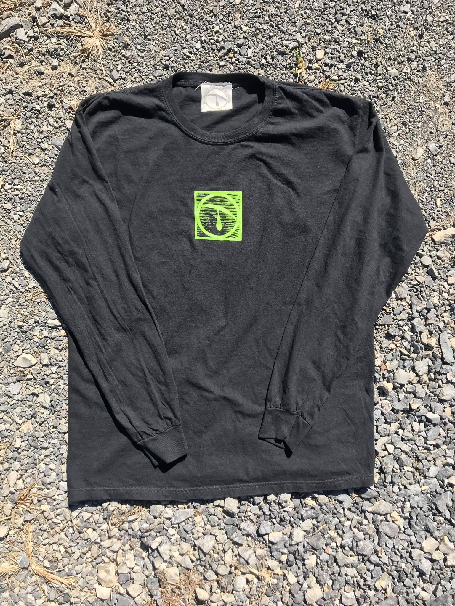
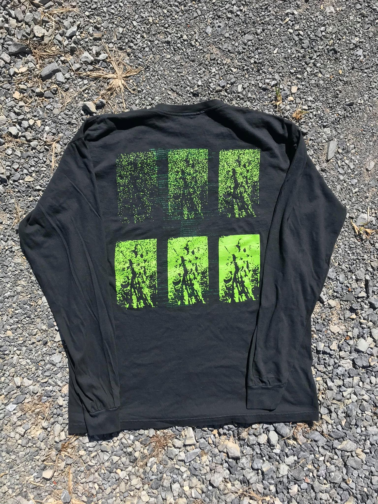
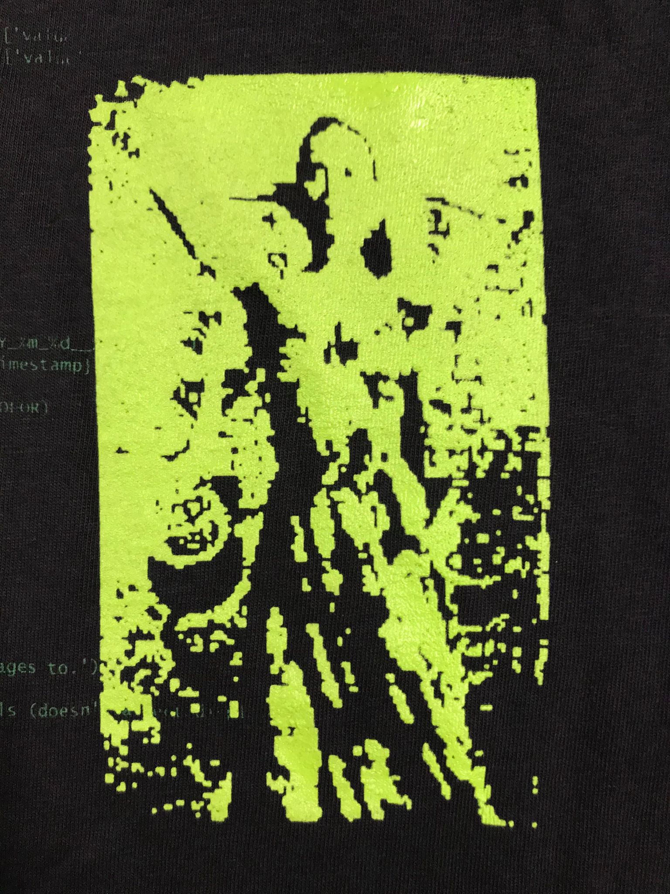
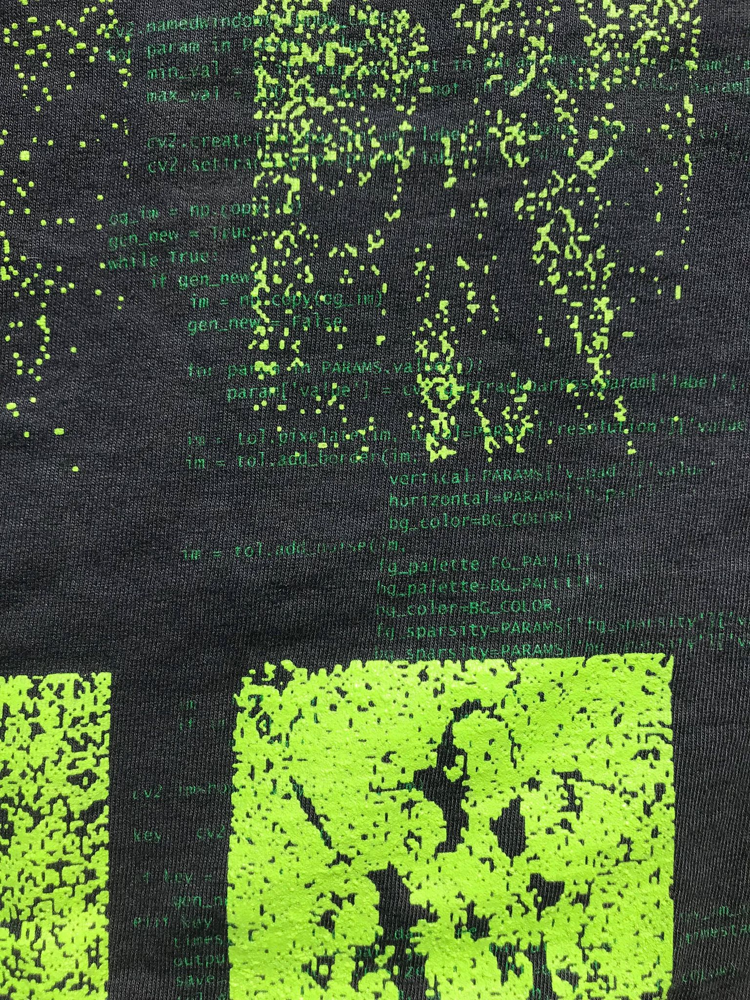
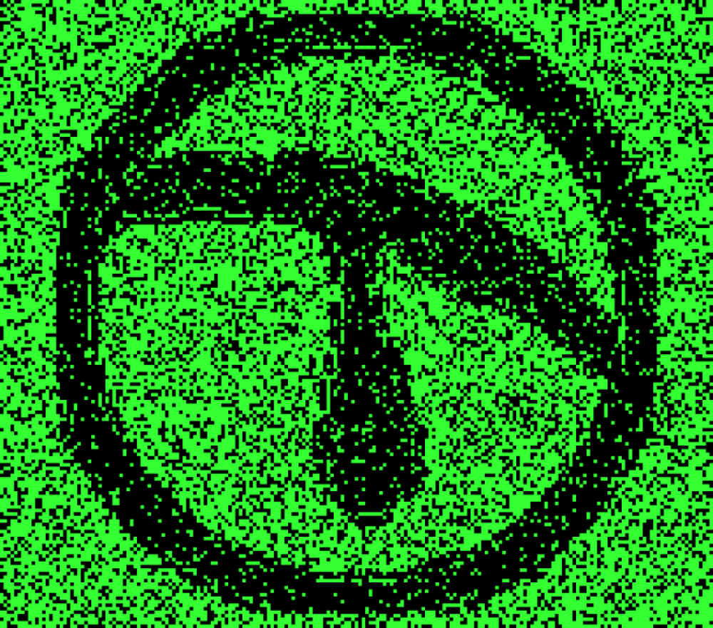

# Generate Images for [tiredoflosing.us](https://www.tiredoflosing.us)

### About

This project was written to help [tiredoflosing.us](https://www.tiredoflosing.us) ([instagram](https://www.instagram.com/tiredoflosing.us/)) in their design process.  The design is not at all mine, I just aided in the tooling, and they were open to the idea of open sourcing the code.

Given, that the code was written for a one time use case, there are some inconisistencies in the code base.  ¯\\\_(ツ)\_/¯

### Output

#### IRL

<p align='center'>


</p>

<p align='center'>


</p>

#### Digital

<p align='center'>

</p>

### Installation:
1. Clone the repo and `cd` into the cloned repo's directory

	```bash
	git clone https://github.com/AdamSpannbauer/tol_design.git
	cd tol_design
	```
	
2. Install the requirements
	
	```bash
	pip install -r requirements.txt
	```

### Usage:

```bash
python3 tol_gui.py -i 'path_to_input_image.png' -o 'path/to/output/folder'
```

#### Arguments:

```
  -i INPUT, --input INPUT
                        Path to png image to use.
  -o OUTPUT, --output OUTPUT
                        Name of directory to save output images to.
  -w WIDTH, --width WIDTH
                        Width of saved image output in pixels (doesn't affect
                        display size).
```

#### User Interface

When you run the above command a UI will appear to adjust the outputted image (seen below).  The inputs are sliders at the bottom of the screen and the keyboard keys listed in the tool bar of the UI's window.

<p align='center'>

</p>

#### About the Process & How to Fine Tune

The image will be broken up into 2 sections, labeled forground (fg) and background (bg).  The background is defined by the user in [`tol_gui.py`](tol_gui.py) with the parameters `BG_COLOR_LO` and `BG_COLOR_HI`.  All pixels falling within this color range will be considered 'background'; all pixels falling outside of the range will be considered 'foreground'.  If both of these range values are set to `None` then the image will be assumed to be a png with an alpha layer, and the transparent regions of the alpha layer will be used as the background.

All pixels are set to the color defined by `BG_COLOR` in [`tol_gui.py`](tol_gui.py).  The rest of the coloring is done by the `BG_PALETTE` & `FG_PALETTE` parameters in [`tol_gui.py`](tol_gui.py).  Pixels are randomly colored colored by the values in these palletes (background with `BG_PALETTE` & foreground with `FG_PALETTE`).  The number of pixels colored with these palettes is adjusted by the 'sparsity' sliders, the rest of the pixels remain the `BG_COLOR`.
